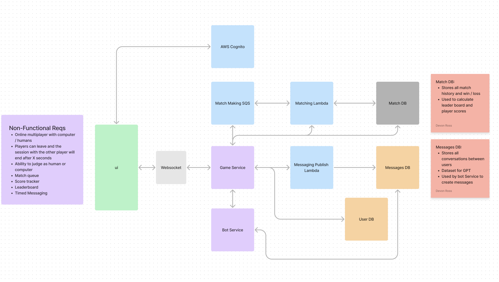

<h1>Turing</h1>

This game was created by Devon Ross, it's based on <a href="https://en.wikipedia.org/wiki/Turing_test">the turing test</a>

<h1>Objective</h1>

Turing is a <a href="https://en.wikipedia.org/wiki/Zero-sum_game">zero-sum game</a>- your objective is to determine if your opponent is a human or a computer while concealing your identity.

<h1>Rules</h1>

You will have two minutes to determine the identity of your opponent, you can send messages back in forth taking turns once every 10 seconds. After 30 seconds you will have the option to submit your judgement on if your opponent is a human or computer. You will score points for identifying your opponent and lose points for incorrect guesses. After you submit your judegement, then the opponent will have 10 sec of Overtime to submit their judgement or abstain for judging (they will not be able to see your judgement until after this time), if they submit a judgement, then rewards / losses are multiplied by 2. After the judgements are determined as correct / incorrect, then the next match will be queued.

<h1>Points</h1>
<ul>
<li>If you guess correctly, then you will gain 1 point and your opponent will lose 1 point</li>
<li>If you guess incorrectly, then you will lose 1 point and your opponent will gain 1 point</li>
<li>If you both guess correctly or incorrectly, then no points are gained or lost</li>
<li>In Overtime if you guess correctly and your opponent guesses incorrectly, then you will gain 2 point and your opponent will lose 2 points</li>
<li>In Overtime if you guess incorrectly and your opponent guesses correctly, then you will lose 2 point and your opponent will gain 2 points</li>
<li>In Overtime if you both guess correctly or incorrectly, then no points are gained or lost</li>
</ul>
<h1>Initial High Level Design (HLD)</h1>
</img>